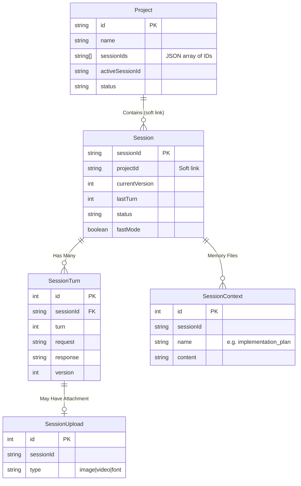

# Database Schema & Architecture

**Location:** `/server/src/entities`

The Code App uses SQLite as its primary database, managed via the **TypeORM** ORM.

## Schema Overview

The database is designed with loose coupling. In version 4.0.0, strict foreign key constraints (e.g., from `Session` to `Project`) were removed to allow for more flexible archiving and cross-project session migration.

## Key Entities
- **Project:** The root container. Stores `sessionIds` in a JSON array rather than relying strictly on reverse lookups.
- **Session:** Represents a single chat thread with the AI. Tracks the `currentVersion` (the active file version index) and `lastTurn`.
- **SessionTurn:** Replaces legacy "SessionVersion" concept for DB tracking. Records the exact prompt (`request`), the LLM response (`response`), and which file `version` was produced.
- **SessionContext:** Stores the "memory files" used by the AI to maintain context across the sliding context window.
- **SessionUpload / SessionResource:** Manages uploaded assets (images, fonts, videos).

## Migration Rules
1. **Never use `synchronize: true` in production.** Always generate migrations via the CLI (`npm run migration:generate -- -n <Name>`).
2. Do not use hard `foreignKey` constraints for `Project <-> Session` relations. Use application-level cascading if deletion is required.
